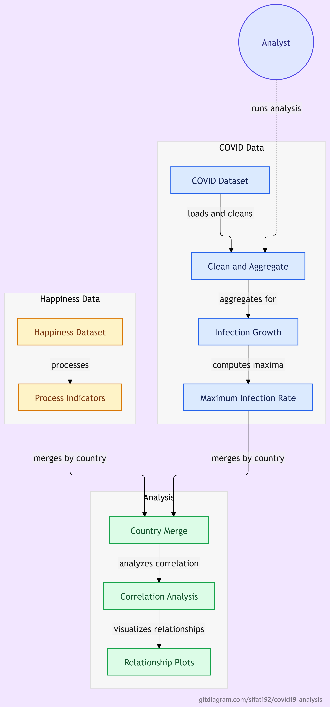

# COVID-19 Data Analysis Using Python

## Overview
This project analyzes global COVID-19 infection trends and studies how they relate to socio-economic indicators from the World Happiness Report.

It focuses on:
- Country-wise COVID-19 infection trends
- Maximum infection rate comparison across countries
- Relationship between COVID-19 spread and factors like GDP, social support, life expectancy, and freedom

This project was inspired by the Coursera course **"COVID-19 Data Analysis Using Python"**.

---

## Tech Stack
- Python
- Pandas
- NumPy
- Matplotlib
- Seaborn

---

## Workflow

- Loaded and cleaned COVID-19 dataset
- Removed unnecessary columns (Lat, Long)
- Aggregated data by country
- Calculated daily infection growth (diff method)
- Computed maximum infection rate per country
- Processed World Happiness dataset
- Merged both datasets using country names
- Performed correlation analysis
- Visualized relationships using scatter plots and regression plots

---

## Analysis Workflow

The diagram outlines COVID-19 data cleaning and aggregation,
maximum infection rate calculation, and processing of happiness
indicators. The datasets are merged by country for correlation
analysis and visualization.

  

[View full-size diagram](covid19-analysis-workflow.png)

---

## Key Insights

- Countries with higher GDP per capita show weak/moderate correlation with infection rates
- Social and economic indicators influence reported infection trends
- Strong variations exist in infection growth patterns across countries
- No single happiness factor strongly determines COVID spread

---

## Requirements
See `requirements.txt`

---

## Credits
- Inspired by Coursera: COVID-19 Data Analysis Using Python

---

## Certificate
Course completed via Coursera:
https://coursera.org/share/8ca93f24fe3722989d7dbec326ec36d3

---

## Author

Sifat Bhatia

Computer Science Engineering Student

Machine Learning Enthusiast

